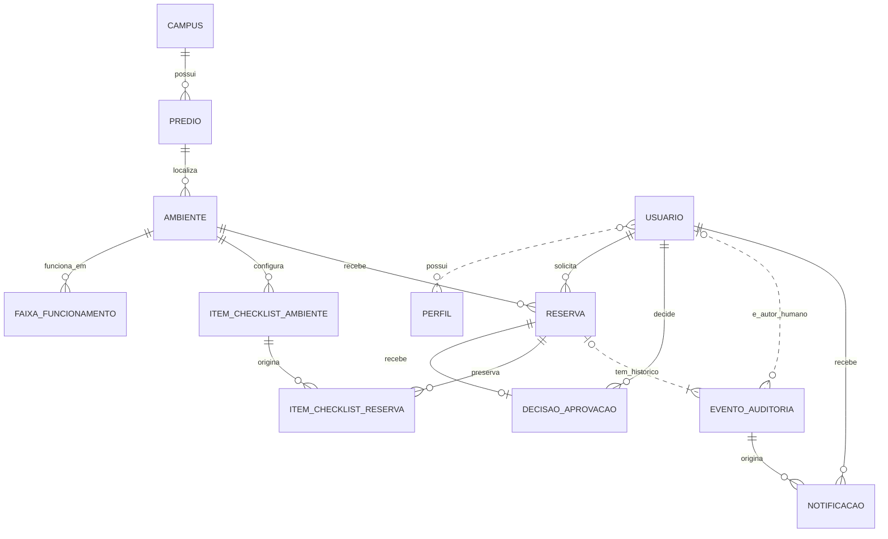

# Modelo conceitual — Sistema de Reservas de Salas e Laboratórios

Data: 08/10/2026

Versão: 1.1 — proposta de DER da Etapa 2, com o limite de check-in confirmado.

Base: [Regras do MVP](../requisitos/REGRAS-MVP.md), acordadas na Etapa 1.

Este documento identifica os conceitos do domínio, seus relacionamentos e cardinalidades. As escolhas de representação são propostas de modelagem; não acrescentam funcionalidades às regras acordadas. Campos completos, tipos SQL, chaves, índices, entidades JPA e migrações serão definidos nas etapas seguintes.

## 1. Como ler o modelo

Uma **entidade** representa algo sobre o qual precisamos guardar informações, como um usuário, um ambiente ou uma reserva. Um **relacionamento** indica como essas entidades se conectam. A **cardinalidade** indica quantas ocorrências podem participar de cada conexão.

- `1`: exatamente uma ocorrência.
- `0..1`: nenhuma ou uma.
- `0..N`: nenhuma, uma ou várias.
- `1..N`: uma ou várias.
- `N:N`: várias ocorrências dos dois lados; será necessária uma associação no modelo lógico.

O DER possui 12 entidades conceituais. Isso não fixa o número de tabelas: relacionamentos como Usuário–Perfil ainda serão transformados em estruturas relacionais na Etapa 3.

## 2. DER completo

Os nomes sem acentos no diagrama são apenas identificadores de visualização, não nomes definitivos de tabelas.

Cada reserva possui exatamente um solicitante e um ambiente. Recebe no máximo uma decisão de aprovação ou recusa. Cancelamento, expiração, entrada e encerramento são eventos distintos no histórico; não são novas decisões de aprovação.

Os eventos administrativos sobre usuários, ambientes e configurações podem existir sem vínculo com uma reserva. Eventos automáticos não possuem autor humano: registram explicitamente a origem Sistema.

## 3. Entidades e responsabilidades

Os dados citados abaixo ilustram o conteúdo de cada conceito. Ainda não são um dicionário completo de campos.

| Entidade | O que representa | Informações principais |
|---|---|---|
| **Campus** | O campus atendido pelo MVP | Identificação e fuso horário |
| **Prédio** | Uma localização física dentro do campus | Identificação e campus |
| **Ambiente** | Uma sala ou laboratório reservável | Código, nome, tipo, capacidade, situação, prédio e configuração atual das regras de reserva |
| **Faixa de funcionamento** | Um intervalo semanal em que um ambiente funciona | Dia da semana, abertura e fechamento |
| **Usuário** | Uma pessoa que acessa o sistema | Nome, identificação institucional, identificação de acesso e situação da conta |
| **Perfil** | Um conjunto de permissões | Professor, Monitor, Coordenação ou Direção |
| **Reserva** | Um pedido individual e seu ciclo de utilização | Solicitante, ambiente, finalidade, participantes previstos, início, fim, estado, regras aplicadas, prazos e registros de entrada/encerramento |
| **Decisão de aprovação** | A decisão única de aprovar ou recusar um pedido | Reserva, autor, resultado, momento e motivo da recusa |
| **Item de checklist do ambiente** | Um item da configuração atual de encerramento | Ambiente, descrição, ordem, obrigatoriedade e situação do item |
| **Item de checklist da reserva** | A cópia histórica de um item e sua resposta naquela reserva | Reserva, item de origem, descrição/ordem/obrigatoriedade preservadas, resposta e momento da resposta |
| **Evento de auditoria** | Um registro histórico de ação administrativa ou de evento da reserva | Origem humana ou Sistema, autor quando houver, ação, momento, objeto afetado, motivo e dados anteriores/posteriores pertinentes |
| **Notificação** | Um aviso interno destinado a uma pessoa | Destinatário, evento de origem, conteúdo, criação e leitura |

### Por que manter Campus e Prédio?

Essas entidades preservam a estrutura física do documento original e organizam a localização dos ambientes. O MVP pode ter apenas um campus cadastrado. A existência da entidade Campus não implementa uma operação com vários campi nem cria permissões entre campi.

### Onde ficam as políticas?

Para este recorte, propõe-se que a configuração efetiva atual pertença ao ambiente. Não haverá herança de políticas entre tipo, unidade e ambiente nesta versão do modelo.

Na criação de uma reserva, os valores efetivamente usados são copiados para ela. Isso atende à preservação das regras sem exigir, neste momento, um mecanismo de várias camadas ou uma entidade separada de versões de política.

Os valores iniciais continuam sendo os acordados: antecedência de 2 horas a 30 dias, duração máxima de 4 horas, preparação e limpeza de 15 minutos, tolerância de check-in de 15 minutos e pré-bloqueio de até 24 horas limitado pelo início da reserva.

Essa organização dos dados não cria, por si só, uma tela de edição para todos esses parâmetros. O modelo físico poderá agrupar a configuração em outra estrutura se houver necessidade técnica, preservando o comportamento acordado.

## 4. Relacionamentos e cardinalidades

| Relacionamento | Cardinalidade e significado |
|---|---|
| Campus → Prédio | Um campus possui `0..N` prédios; cada prédio pertence a exatamente `1` campus. |
| Prédio → Ambiente | Um prédio possui `0..N` ambientes; cada ambiente pertence a exatamente `1` prédio. |
| Ambiente → Faixa de funcionamento | Um ambiente possui `0..N` faixas semanais; cada faixa pertence a exatamente `1` ambiente. |
| Usuário ↔ Perfil | Relação `N:N`: um usuário pode acumular perfis e cada perfil pode ser atribuído a vários usuários. A cardinalidade permite usuário ainda sem perfil; esse usuário não pode solicitar nem aprovar. |
| Usuário → Reserva | Um usuário solicita `0..N` reservas; cada reserva possui exatamente `1` solicitante. |
| Ambiente → Reserva | Um ambiente recebe `0..N` reservas ao longo do tempo; cada reserva é de exatamente `1` ambiente. Isso não permite sobreposição de ocupações válidas. |
| Reserva → Decisão de aprovação | Uma reserva possui `0..1` decisão; cada decisão pertence a exatamente `1` reserva. Pendentes, expiradas sem decisão e canceladas antes da decisão não têm decisão de aprovação. |
| Usuário → Decisão de aprovação | Um usuário realiza `0..N` decisões; cada decisão possui exatamente `1` autor humano autorizado. |
| Ambiente → Item de checklist do ambiente | Um ambiente configura `0..N` itens; cada item pertence a exatamente `1` ambiente. |
| Reserva → Item de checklist da reserva | Uma reserva possui `0..N` itens copiados; cada item copiado pertence a exatamente `1` reserva. |
| Item de checklist do ambiente → Item de checklist da reserva | Um item de origem gera `0..N` cópias ao longo do tempo; cada cópia possui exatamente `1` origem. O item de origem deve ser preservado, mesmo quando inativado. |
| Reserva → Evento de auditoria | Cada reserva tem `1..N` eventos, incluindo sua criação. Cada evento pode referenciar `0..1` reserva, pois ações sobre outros cadastros também são auditadas. |
| Usuário → Evento de auditoria | Um usuário é autor de `0..N` eventos; cada evento possui `0..1` autor humano. Eventos humanos exigem autor; eventos do Sistema identificam essa origem explicitamente. |
| Evento de auditoria → Notificação | Um evento origina `0..N` avisos; cada aviso aponta para exatamente `1` evento. Nem toda ação auditada exige notificação. |
| Usuário → Notificação | Um usuário recebe `0..N` avisos; cada aviso tem exatamente `1` destinatário. Um mesmo evento pode originar avisos para destinatários diferentes. |

O mínimo zero nos cadastros permite que sejam montados gradualmente. Ausência de uma faixa de funcionamento cobrindo o intervalo impede a reserva. Os itens reais do checklist precisam ser preenchidos para a demonstração; este modelo não inventa uma quantidade mínima de itens.

## 5. Decisões de modelagem que simplificam o MVP

### 5.1 Uma pessoa, vários perfis

Professor, Monitor, Coordenação e Direção não são entidades separadas de pessoas. São registros de Perfil associados a Usuário.

Exemplo: uma pessoa que integra a direção e também é professora possui um único cadastro com dois perfis. Pode solicitar por possuir o perfil Professor e analisar pedidos de outras pessoas por possuir Direção. A proibição de autoaprovação compara a identidade da pessoa, não apenas o perfil usado na ação.

No modelo lógico, a relação N:N será convertida em uma associação entre usuários e perfis, sem duplicar a pessoa.

### 5.2 Reserva centraliza o pedido e seus marcos

O estado atual, o prazo de expiração, o momento do check-in e o registro de encerramento pertencem conceitualmente à reserva. Não é necessário criar entidades independentes para cada estado.

O histórico guarda os acontecimentos e seus autores. A decisão de aprovação fica separada porque precisa preservar resultado, autor e momento mesmo que a reserva seja cancelada depois.

Um encerramento registrado não comprova, por si só, o instante físico de saída. O modelo distingue o registro feito pelo solicitante da regularização administrativa, com autor e justificativa no histórico.

### 5.3 Pré-bloqueio e disponibilidade são comportamentos da reserva

Não se propõe uma entidade Pré-bloqueio separada. O estado pendente, seu prazo e o intervalo ocupado são suficientes para representar a ocupação provisória do MVP.

Também não se propõem tabelas de “horários disponíveis” ou uma agenda independente. A disponibilidade resulta da comparação entre funcionamento, períodos solicitados, buffers preservados e reservas que ainda ocupam o intervalo.

Um pedido pendente cujo prazo já acabou não mantém o bloqueio apenas porque uma tarefa automática atrasou. As operações devem verificar os prazos persistidos; o evento de expiração e a atualização do estado precisam continuar consistentes com essa verificação.

### 5.4 Preservar regras aplicadas

Consultar apenas os parâmetros atuais do ambiente seria insuficiente: uma mudança de limpeza poderia alterar a interpretação de uma reserva antiga.

A reserva conserva os parâmetros aplicados e os prazos produzidos na sua criação. O intervalo ocupado pode ser obtido de início, fim e buffers preservados. A decisão de também persistir limites derivados será tomada na modelagem lógica, evitando valores redundantes sem controle de consistência.

### 5.5 Preservar o checklist sem exigir versões completas de modelo

Na criação da reserva, propõe-se copiar os itens ativos do checklist do ambiente para os itens de checklist da reserva. Cada cópia preserva a descrição, a ordem e a obrigatoriedade daquele momento; a resposta é preenchida durante o uso.

Alterar o texto ou inativar um item no ambiente não modifica as cópias existentes. A relação com o item de origem permite rastrear sua procedência, mas a apresentação histórica usa os valores copiados.

A cópia deve vir do mesmo ambiente da reserva e cada item de origem só aparece uma vez naquela reserva. A conclusão normal exige resposta afirmativa para os itens obrigatórios. A regularização administrativa permanece distinguível e não deve fabricar respostas em nome do solicitante.

### 5.6 Uma trilha de auditoria para ações e transições

Evento de auditoria guarda tanto as transições de reserva quanto alterações administrativas em usuários, perfis, ambientes e configurações.

Para eventos de reserva, o vínculo com a reserva é explícito. Para outros eventos, registra-se a identificação do objeto afetado e os dados históricos pertinentes. A forma física desses alvos será detalhada na Etapa 3; não se presume que um identificador genérico forneça integridade referencial com todas as tabelas.

Os eventos são imutáveis. Mudanças de estado, decisão e registro histórico correspondente devem formar uma operação consistente. Credenciais, senhas e tokens não devem compor os valores de antes/depois.

### 5.7 Notificação interna como referência

A entidade Notificação representa o aviso interno previsto no documento original, inclusive o aviso ao solicitante em cancelamentos administrativos. O usuário pode abrir a reserva de origem a partir do evento, respeitando a autorização.

Essa proposta não inclui SMTP, envio por e-mail ou avisos para todos os eventos. O canal externo e a seleção completa de eventos notificáveis não foram acordados na Etapa 1.

## 6. Estados e ocupação não são a mesma informação

| Situação da reserva | Tratamento conceitual da ocupação |
|---|---|
| Pendente, com pré-bloqueio válido | Ocupa o intervalo de preparação, utilização e limpeza. |
| Pendente, com prazo expirado | Não deve bloquear novos pedidos; deve ser tratada como expirada nas operações aplicáveis. |
| Aprovada | Mantém o intervalo ocupado, sujeito à liberação por cancelamento ou não comparecimento conforme as regras. |
| Em uso | Mantém o intervalo programado. Atraso no encerramento não estende automaticamente a agenda. |
| Encerrada antecipadamente | Continua ocupando o intervalo originalmente reservado, incluindo limpeza. |
| Recusada, Cancelada, Expirada ou Não compareceu | Não impede novas reservas para o período restante; seus dados continuam no histórico. |

O fato de um intervalo não bloquear mais a agenda não apaga o uso passado. No-show e expiração precisam ser processados sem duplicação de eventos e sem depender exclusivamente da pontualidade da tarefa periódica.

A pendência de encerramento pode ser reconhecida quando a reserva continua Em uso e seu término previsto já chegou. Propõe-se tratá-la como condição derivada, sem criar mais um estado nesta etapa.

O DER não garante ausência de sobreposição. Essa garantia também depende do procedimento transacional já definido no RNF04: bloquear o ambiente, recalcular conflitos e persistir a operação de forma consistente. O mecanismo será detalhado junto com o backend.

## 7. Exemplos para revisar o modelo

### Exemplo A — Professor reserva e a coordenação aprova

1. Existe um Usuário com perfil Professor e um Ambiente com funcionamento e checklist configurados.
2. O envio cria uma Reserva, suas cópias de checklist e seu evento de criação. Os parâmetros aplicados e a expiração ficam preservados.
3. Outro Usuário, com perfil Coordenação, registra uma Decisão de aprovação.
4. A Reserva muda para Aprovada e o Evento de auditoria registra a ação e seu autor.
5. O solicitante faz check-in, responde os itens copiados e encerra. Entrada e encerramento ficam registrados na reserva e em seu histórico.

### Exemplo B — Reserva aprovada é cancelada

1. A reserva já possui uma decisão favorável.
2. O titular cancela antes do início, com motivo.
3. O estado atual passa para Cancelada e um evento registra autor e motivo.
4. A decisão favorável original continua existindo. O histórico permite explicar por que uma reserva aprovada não foi utilizada.

### Exemplo C — Checklist muda depois da solicitação

1. A reserva foi criada quando havia o item obrigatório “Desligar o projetor”.
2. A direção altera o item atual do ambiente para “Desligar projetor e computador”.
3. A cópia da reserva anterior continua com a descrição original e preserva sua resposta.
4. Reservas novas recebem a configuração nova. A mudança de cadastro também é auditada.

## 8. Rastreabilidade com as regras do MVP

| Regra ou necessidade | Elementos que a sustentam |
|---|---|
| Uma pessoa pode acumular funções | Usuário N:N Perfil |
| Não aprovar a própria solicitação | Solicitante da Reserva e autor da Decisão de aprovação |
| Localização e fuso | Campus, Prédio e Ambiente |
| Funcionamento semanal | Faixa de funcionamento ligada ao Ambiente |
| Capacidade e alterações que afetam pedidos | Capacidade do Ambiente e participantes previstos da Reserva |
| Antecedência, duração, buffers e prazos | Períodos, parâmetros preservados e prazos da Reserva |
| Apenas uma decisão de aprovação/recusa | Reserva com 0..1 Decisão de aprovação |
| Cancelamento com motivo e histórico | Estado atual da Reserva e Evento de auditoria |
| Check-in e não comparecimento | Estado, momento de entrada e prazo de check-in da Reserva; eventos automáticos |
| Checklist exigido e respostas preservados | Item de checklist do ambiente e Item de checklist da reserva |
| Encerramento normal ou administrativo | Registro de encerramento, sua natureza e evento com autor/justificativa |
| Aviso ao solicitante | Notificação ligada a destinatário e evento |
| Alterações administrativas rastreáveis | Evento de auditoria com objeto afetado e dados pertinentes |

## 9. Limites da proposta e revisão

### Escolhas técnicas propostas nesta etapa

- Configuração efetiva por ambiente, sem herança por unidade/tipo.
- Parâmetros aplicados preservados na própria reserva.
- Checklist copiado para a reserva no envio, com resposta no item copiado.
- Decisão de aprovação separada do histórico geral.
- Pré-bloqueio representado por estado e prazo da reserva.
- Pendência de encerramento como condição derivada.
- Avisos internos associados ao evento que os originou.

Essas escolhas permitem detalhar um modelo relacional coerente sem implementar módulos que ficaram para depois. Podem ser revistas com o backend sem mudar as regras de negócio acordadas.

### Caso de borda resolvido: reserva curta e check-in

As regras permitem uma duração inferior a 15 minutos. Foi confirmado que o check-in só pode ocorrer enquanto o período reservado ainda estiver em andamento, além de respeitar a tolerância aplicada à reserva.

As condições são simultâneas: `início <= agora < fim` e `agora <= início + tolerância aplicada`. Para uma reserva das 14h às 14h10, por exemplo, o check-in deve acontecer antes das 14h10. A ausência de check-in quando essa janela fecha permite o registro de não comparecimento. A decisão está incorporada às Regras do MVP e não altera as entidades ou cardinalidades do DER.

### Próxima entrega

A Etapa 3 deverá transformar este DER em modelo lógico e dicionário de dados: atributos completos, obrigatoriedade, identificadores, associação Usuário–Perfil, domínios de estado, restrições e política de preservação dos registros. Só depois serão definidos os scripts SQL e as migrações.
